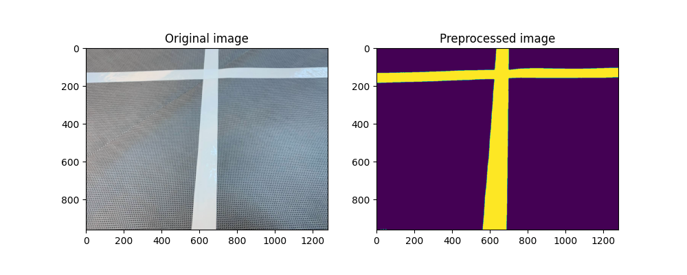

# Line Following Robot
Developping an autonomous line following robot that is capable to navigate lines, intersections and roundabouts as part of a project at CentraleSupélec

## Demo
**Turning at an intersection**

**Detecting an obstacle and changing the route to avoid it**

**Navigating a roundabout**

## Utilities
I have included many useful functions to reproduce the result in utilities.py such as:

**image_preprocessing**: image preprocessing to isolate white lines in an image

**direction**: finds the main line in an image and returns its position in pixels

**turn_detection**: detects left and right turns if they are close

**detect_red**: detects red in an image

